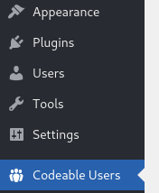
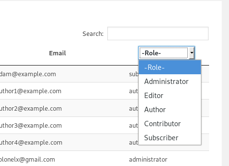
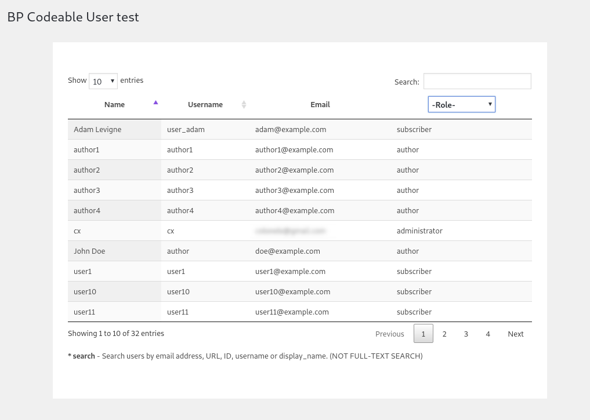

# Codeable Users Test

This is a test project to be viewed by codeable.io.

## Getting Started

This is a Wordpress plugin and to work as such this should exist in the `wp-content/plugins` directory.

### Initial problem

Create a plugin that creates a custom HTML table in an admin page where we have a list of users that we can filter by role and order them in alphabetical order by name and username. The role filter and ordering must both work via AJAX, please add a pagination with ten users per page (number can be hardcoded). Please don't use the class WP_List_Table to create the table, it must be custom coded. Please create a list of 30 or more dummy users in a CSV file with different roles (you can use the standard WP roles) and import them via the free plugin 'Import users from CSV with meta' available in the WordPress plugin directory. The list must contain one role with at least 11 users. One role must be left with zero users. Please send us the file with the dummy users along with the plugin that you create

### Prerequisites

1). Wordpress >4.8.x (Basically you should never be using outdated wp-core versions, as this might cause a security risk.)

2). `Import users from CSV with meta` Plugin - Used for importing dummy users.

## Deployment

1). Download as zip.

2). Unzip in `wp-content/plugins` directory.

3). Rename directory to `bp-codeable-users-test`.

4). Go to your WP Administration area (or use wp-cli) and enable the `BP Codeable Users Test` plugin.

You may find the users example file I used for testing in [examples/codeable-users-example.csv](examples/codeable-users-example.csv)

## Working with the plugin

The plugin uses [jQuery Datatables library](https://datatables.net/), configured to request json data on each itteraction (work server-side).

### Plugin admin page

Once the plugin is enabled, you should see the Admin menu Page called `Codeable Users`.

### Filtering on columns

Currently filtering is enabled only on the `role` column. Just click on the Dropdown that says `-Role-` and select the required role. Empty roles currently are: `Editor` and `Contributor`.
_Note that one user might have multiple roles._

### Pagination

You may select how many items to show per single page on the top left corner of the table. Based on that the pages are being calculated

### Ordering columns

Only the columns `Name` and `Username` are currently being used for ordering the data. By clicking on the name you choose to order that column in either ascending or descending order.

## PHPUnit tests

1). `composer install`

2). `./vendor/bin/phpunit`

## Authors

* **Viktor Panteleev** - [Website](https://www.vpanteleev.com)

## License

This project is licensed under the [GNU GPLv2 License](LICENSE)

## Usages

1). [jQuery Datatables library](https://datatables.net/)

2). [Import users from CSV with meta](https://wordpress.org/plugins/import-users-from-csv-with-meta/)